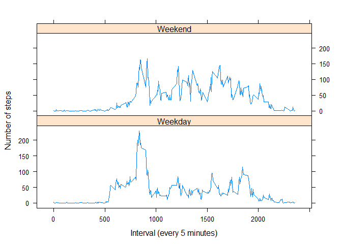

#Peer Assessment 1
author: "Pang KJ"
---
## 1. Download, unzip, and load data 


```r
#doanload and unzip data
if(!file.exists("activity.csv") )
{
  url<-"https://d396qusza40orc.cloudfront.net/repdata%2Fdata%2Factivity.zip"
  filename<-"repdata_data_activity.zip"
  download.file(url,filename)
  unzip(filename)
}
#read data
Activity<- read.csv("activity.csv")
```

## 2. What is the mean total number of steps taken per day?


```r
options(scipen = 1, digits = 0)
Steps<-tapply(Activity$steps, Activity$date, sum)
step_median<- median(Steps,na.rm=TRUE)
step_mean<- mean(Steps,na.rm=TRUE)
hist(Steps, breaks=25,
     main="Histgram of total numbers taken each day",
     xlab="Steps taken each day")
```

 

The mean and median of total number of steps taken each day are 10765 and 10766, repectively.

## 3. What is the average daily activity pattern?


```r
#get rid of data with NA's
Activity1<-Activity[complete.cases(Activity),]
#get the average steps taken in each interval across all days
DailyPattern<-tapply(Activity1$steps, Activity1$interval, mean)
#Create a dataframe from Array DailyPattern with variables:interval and steps (average)
Step_Minute<-data.frame(interval=as.numeric(names(DailyPattern)), steps=DailyPattern)
#Plot interval VS average steps
plot(Step_Minute, type="l", 
     main="Daily activity pattern", 
     xlab="Time Interval (every 5 minutes)",
     ylab="Steps")
```

 

```r
#Get the interval value of the highest average step
max<-Step_Minute[Step_Minute$steps==max(Step_Minute$steps),]
```

The 835 th interval, on average across all the days in the dataset, contains the maximum number of steps : 206 steps.

## 4. Imputing missing values
Strategy: 
Each missing data (NA) under variable 'steps' will be filled with the mean value of that particular 5-minute interval of all days in this dataset.


```r
#Get the number of data with NA's
Num_Missing<-!complete.cases(Activity)
missing <-nrow(Activity[Num_Missing,]) 
#create a new dataset Activity2, which is identical to Activity
Activity2<-Activity
#fill NA's in dataset Activity2 with the mean of correspondent intervals
for (i in 1  : nrow(Activity2) )
  {
    if (is.na(Activity2$steps[i])) 
      {
         Activity2$steps[i]=Step_Minute[Step_Minute$interval==(Activity2$interval[i]),2]
      }
  }
#get the total number of steps taken in each day
Steps2<-tapply(Activity2$steps, Activity2$date, sum)
#get the median and mean, and plot a histogram
New_median<-median(Steps2)
New_mean<- mean(Steps2)
hist(Steps2, breaks=60,
     main="Histgram of total numbers taken each day",
     xlab="Steps taken each day")
```

 

There are 2304 missing values in the dataset. The median and mean of the new dataset Activity2 are 10766 and 10766, respectively. The mean value of steps taken in each interval did not change, however, the median changed a little bit, from 10765 to 10766.

## 5. Are there differences in activity patterns between weekdays and weekends?


```r
#Add a new variable DayCategory to Activity2 with two levels: Weekday and weekend
for (i in 1  : nrow(Activity2) )
{
  if (weekdays(as.Date(Activity2$date[i]))=="Saturday" | weekdays(as.Date(Activity2$date[i]))=="Sunday") 
  {
    Activity2$DayCategory[i]<-"weekend"
  }
  else
  {
    Activity2$DayCategory[i]<-"weekday"
  }
}
#get mean steps taken in each interval for all weekdays and weekends, respectively
Act_Weekday<-Activity2[Activity2$DayCategory=="weekday",]
Act_Weekend<-Activity2[Activity2$DayCategory=="weekend",]
WeekdayPattern<-tapply(Act_Weekday$steps, Act_Weekday$interval, mean)
WeekendPattern<-tapply(Act_Weekend$steps, Act_Weekend$interval, mean)
Step_Weekday<-data.frame(interval=as.numeric(names(WeekdayPattern)), steps=WeekdayPattern,DayCategory="Weekday")
Step_Weekend<-data.frame(interval=as.numeric(names(WeekendPattern)), steps=WeekendPattern,DayCategory="Weekend")
#combine two dataframes together
Stepdata=rbind(Step_Weekday,Step_Weekend)
#Plot steps vs interval for both weekday and weekend (levels)
DayCategory<-as.factor(Stepdata$DayCategory)
if(!require(lattice))
{
    install.packages("lattice")
    require(lattice)
}
```

```
## Loading required package: lattice
```

```r
xyplot(steps ~ interval | DayCategory, data = Stepdata, type = "l",layout = c(1, 2),
       xlab="Interval (every 5 minutes)", ylab="Number of steps")
```

 

Yes, the activity patterns of weekdays and weekends are different. During weekends, people started their activities later than they did in weekdays, and the intensity of activities later in the day would be higher than that in weekdays. Also, people tended to go to bed later during weekends than in weekdays. 


